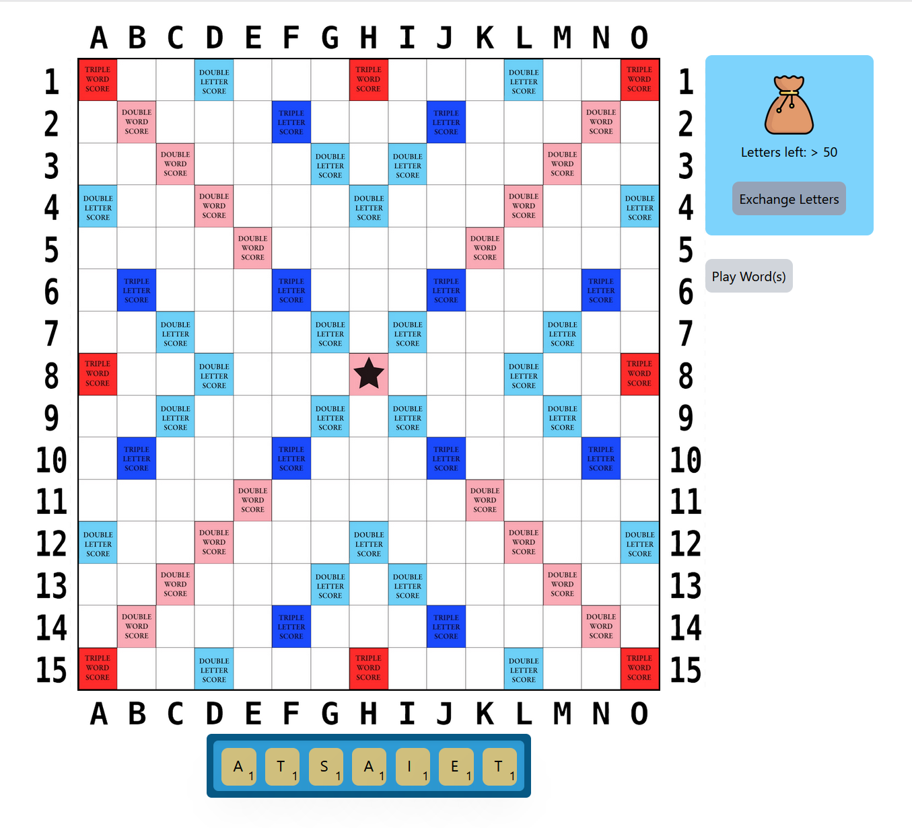

# Online 4-player Scrabble game with Next.js + Tailwind.css

In its finished state, this project will allow 2-4 players to play Scrabble online. (Currently only two-player Scrabble platforms are available for some reason.)

## State of the project

For now, the project is in a half-finished state; the game starts on the 'game page' with only one player present. Browser refresh will reset the game state, allowing for a test of basic Scrabble functionality.

In its finished state, the app will have a starting page with 'Create Game' and 'Join Game' UI flows. The game creator will specify the desired number of players, name the game and set a password; once enough players have joined, the game will transition to the game page. Once the letter pouch is empty and one player has used all their letters, the game will end (as per standard Scrabble rules). Word validity will be checked via a free online dictionary API.

No accounts, achievements, etc are planned, even for the final version. The aim is to make a very simple app that allows for a casual 4-player Scrabble game.

## Testing the app

If you want to see / test the app UI, it can be done as follows:

1. Download / git clone the project.

2. In the main folder, run 'npm install' via command line.

3. Then run 'npm run dev'. A browser window should open, showing the app UI. You can place letters and verify that the app conforms to standard Scrabble logic (first word has to include the center tile; no angles within words; etc).

## Screenshot

